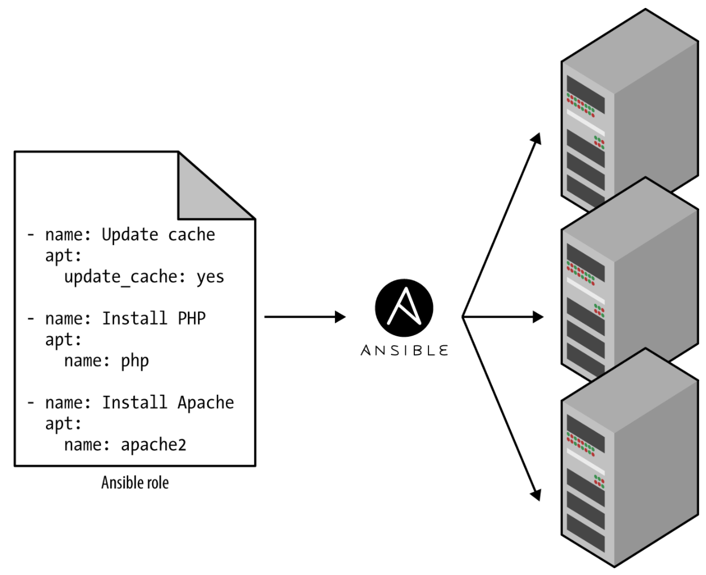
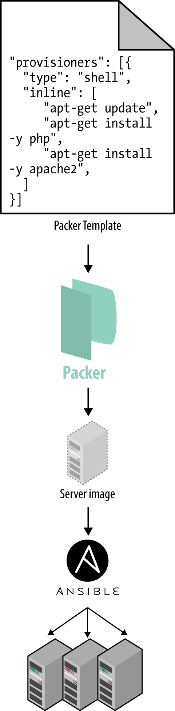
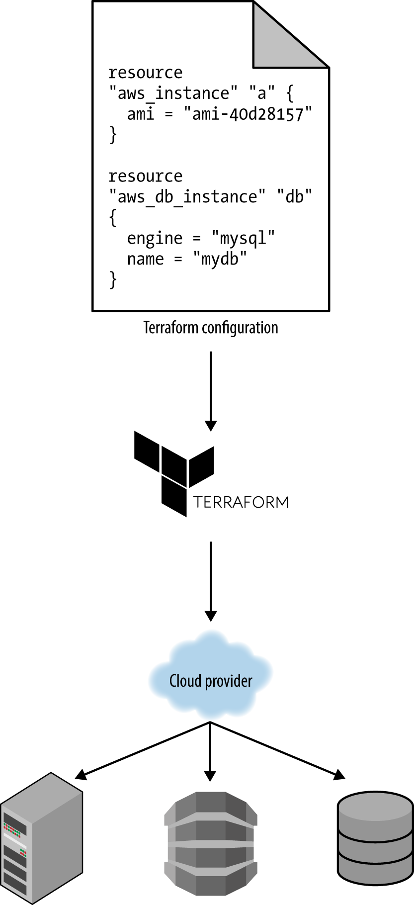

Infrastructure as Code
======================

The idea behind *infrastructure as code* (IAC) is that you write code and execute code to define, deploy and update your infrastructure, treating all aspects of operations as software. In fact, a key insight of DevOps is that you can manage almost *everything* in code, including servers, databases, networks, log files, application configuration, documentation, automated tests, deployment processes, and so on.

There are four broad categories of IAC tools:

* Ad hoc scripts
* Configuration management tools
* Server templating tools
* Server provisioning tools

Ad hoc scripts
--------------

The easiest approach to automating anything is to write an ad hoc script. You take whatever task you were doing manually, break it down into discrete steps, use your favorite scripting language to define each of those steps in code, and execute that script on your server. For example, the below Bash script configures a web server by installing dependencies, checking out some code from a Git repo, and firing up the Apache web server:

.. code-block:: bash

     # Update the apt-get cache
     sudo apt-get update

     # Install PHP
     sudo apt-get install -y php

     # Install Apache
     sudo apt-get install -y apache2

     # Copy the code from the repository
     sudo git clone https://github.com/dppascual/php-app.git /var/www/html/app

     # Start Apache
     sudo service apache2 start

The benefit of using ad hoc scripts is that you can use general-purpose programming languages and you can write the code however you want. The terrible thing about ad hoc scripts is you have to write completely custom code for every task, whereas tools designed for IAC provide concise APIs for accomplishing complicated tasks.

Moreover, IAC tools usually enforce a particular structure for your code, whereas with a general-purpose programming language, each developer will use his or her own style and do something different which almost always devolves into a mess of unmaintainable spaghetti code. Neither of these problems is a big deal for an eight-line script that installs Apache, but it gets messy if you try to use ad hoc scripts to manage dozens of servers, databases, load balancers, network configurations, and so on.

Ad hoc scripts are great for small, one-off tasks, but if you’re going to be managing all of your infrastructure as code, then you should use an IAC tool that is purpose-built for the job.

Configuration management tools
------------------------------

Chef, Puppet, Ansible, and SaltStack are all *configuration management* tools, which means they are designed to install and manage software on existing servers. For example, the below *Ansible Role* configures the same Apache web server as the previous script:

.. code-block:: ansible

	- name: Update the apt-get cache
      apt:
		update_cache: yes

	- name: Install PHP
      apt:
		name: php

	- name: Install Apache
      apt:
		name: apache2

	- name: Copy the code from the repository
      git: repo=https://github.com/dppascual/php-app.git dest=/var/www/html/app

	- name: Start Apache
      service: name=apache2 state=started enabled=yes

The code looks similar to the Bash script, but using a tool like Ansible offers a number of advantages:

**Coding conventions**
	Ansible enforces a consistent, predictable structure, including documentation, file layout, clearly named parameters, secrets management, and so on. While every developer organizes his or her ad hoc scripts in a different way, most configuration management tools come with a set of conventions that makes it easier to navigate the code.

**Idempotence**
	Writing an ad hoc script that works once isn’t too difficult; writing an ad hoc script that works correctly even if you run it over and over again is a lot harder. Every time you go to create a folder in your script, you need to remember to check if that folder already exists; every time you add a line of configuration to a file, you need to check that line doesn’t already exist; every time you want to run an app, you need to check that the app isn’t already running.

	Code that works correctly no matter how many times you run it is called *idempotent code*. To make the Bash script from the previous section idempotent, you’d have to add many lines of code, including lots of if-statements. Most Ansible functions, on the other hand, are idempotent by default.

**Distribution**
	Ad hoc scripts are designed to run on a single, local machine. Ansible and other configuration management tools are designed specifically for managing large numbers of remote servers.

Server Templating Tools
-----------------------

An alternative to configuration management that has been growing in popularity recently are *server templating tools* such as Docker, Packer, and Vagrant. Instead of launching a bunch of servers and configuring them by running the same code on each one, the idea behind server templating tools is to create an *image* of a server that captures a fully self-contained “snapshot” of the operating system, the software, the files, and all other relevant details. You can then use some other IAC tool to install that image on all of your servers, as shown in the below picture.

There are two broad categories of tools for working with images:

- Virtual Machines
- Containers

For example, the below *Packer template*, that creates an *Amazon Machine Image* (AMI) which is a VM Image you can run on Amazon Web Services (AWS), configures the same Apache web server you saw previously using the same Bash code:

.. code-block::

	{
	  "builders": [{
		"ami_name": "packer-example",
		"instance_type": "t2.micro",
		"region": "us-east-1",
		"type": "amazon-ebs",
		"source_ami": "ami-40d28157",
		"ssh_username": "ubuntu"
	  }],
	  "provisioners": [{
		"type": "shell",
		"inline": [
		  "sudo apt-get update",
		  "sudo apt-get install -y php",
		  "sudo apt-get install -y apache2",
		  "sudo git clone https://github.com/brikis98/php-app.git /var/www/html/app"
		]
	  }]
	}

The only difference between the preceding code and previous examples is that this Packer template does not start the Apache web server (e.g., by calling **sudo service apache2 start**). That’s because server templates are typically used to install software in images, but it’s only when you run the image (e.g., by deploying it on a server) that you should actually run that software.

Note that the different server templating tools have slightly different purposes. Packer is typically used to create images that you run directly on top of production servers, such as an AMI that you run in your production AWS account. Vagrant is typically used to create images that you run on your development computers, such as a VirtualBox image that you run on your Mac or Windows laptop. Docker is typically used to create images of individual applications. You can run the Docker images on production or development computers, so long as some other tool has configured that computer with the Docker Engine. For example, a common pattern is to use Packer to create an AMI that has the Docker Engine installed, deploy that AMI on a cluster of servers in your AWS account, and then deploy individual Docker containers across that cluster to run your applications.

Server templating is a key component of the shift to *immutable infrastructure*. This idea is inspired by functional programming, where variables are immutable, so once you’ve set a variable to a value, you can never change that variable again. If you need to update something, you create a new variable. Since variables never change, it’s a lot easier to reason about your code.

The idea behind immutable infrastructure is similar: once you’ve deployed a server, you never make changes to it again. If you need to update something (e.g., deploy a new version of your code), you create a new image from your server template and you deploy it on a new server. Since servers never change, it’s a lot easier to reason about what’s deployed.

Server Provisioning Tools
-------------------------

Whereas configuration management and server templating tools define the code that runs on each server, *server provisioning tools* such as Terraform, CloudFormation, and OpenStack Heat are responsible for creating the servers themselves. In fact, you can use provisioning tools to not only create servers, but also databases, caches, load balancers, queues, monitoring, subnet configurations, firewall settings, routing rules, SSL certificates, and almost every other aspect of your infrastructure, as shown in the below Figure.

For example, the following code deploys a web server using Terraform:

.. code-block:: 

	resource "aws_instance" "app" {
	  instance_type     = "t2.micro"
	  availability_zone = "us-east-1a"
	  ami               = "ami-40d28157"

	  user_data = <<-EOF
				  #!/bin/bash
				  sudo service apache2 start
				  EOF
	}
